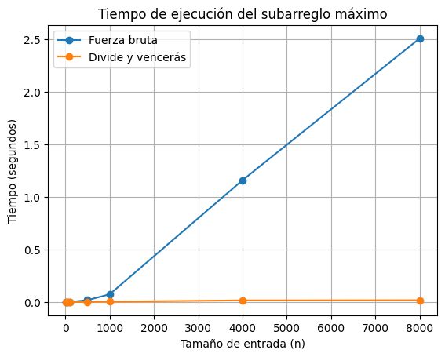

# Laboratorio evaluativo 02 — Dividir y vencer

**Nombre:** Juan Felipe Cadavid Zabala

## Instrucciones para reproducir el experimento

Activar el entorno virtual:

```text
venv\Scripts\activate
```

Ejecutar las pruebas:

```text
python pruebas.py
```

Ejecutar las mediciones:

```text
python medicion.py
```

## Parte 1 — Implementación y verificación

**Código:** [subarreglo.py](subarreglo.py)  
**Pruebas:** [pruebas.py](pruebas.py)

Para verificar que las dos soluciones funcionaran correctamente utilicé varios casos de prueba. Primero probé la serie propuesta en el problema, la mejor racha tiene una suma de 17. Después probé una lista de un solo elemento, una lista con todos los valores negativos, otra con todos los valores positivos y un caso donde la mejor racha cruza el punto medio.

También generé 20 listas aleatorias utilizando una semilla fija y comparé la suma obtenida por fuerza bruta con la obtenida por divide y vencerás. En estas pruebas solamente comparé la suma máxima, porque pueden existir diferentes tramos que tengan el mismo resultado.

## Parte 2 — Medición y gráfica

**Código:** [medicion.py](medicion.py)

Para comparar los dos algoritmos utilicé tamaños de entrada de 10, 50, 100, 500, 1000, 4000 y 8000 elementos. Los datos se generaron con una semilla fija y con valores enteros entre -100 y 100.

Para cada tamaño generé una lista y utilicé exactamente la misma entrada para fuerza bruta y divide y vencerás. El tiempo se midió con `time.perf_counter()` y solamente se cronometró la ejecución de los algoritmos, sin incluir la generación de los datos.

También verifiqué en cada tamaño que los dos algoritmos obtuvieran la misma suma máxima.



## Parte 3 — Análisis

### 1. Recurrencia y complejidad

El algoritmo `subarreglo_maximo` divide la lista en dos mitades y resuelve cada una por separado. Por eso aparecen dos llamadas recursivas de tamaño `n/2`. Después calcula la mejor racha que cruza el centro, lo cual necesita recorrer los elementos de ambos lados y cuesta Θ(n).

La recurrencia queda así:

`T(n) = 2T(n/2) + Θ(n)`

En el método maestro, `a = 2`, `b = 2` y `f(n) = Θ(n)`. Como `n^(log₂ 2) = n` y `f(n)` tiene ese mismo orden, se aplica el caso 2. El resultado es **Θ(n log n)**.

En fuerza bruta se prueban todos los tramos posibles. El número de iteraciones corresponde a `n + (n-1) + ... + 1 = n(n+1)/2`. Por eso su complejidad es **Θ(n²)**.

### 2. Comparación entre los resultados y la teoría

En la gráfica se ve que el tiempo de fuerza bruta aumenta mucho más que el de divide y vencerás. Para comparar, tomé los tamaños 500 y 1000.

Fuerza bruta pasó de 0,018381 a 0,073359 segundos. El tiempo se multiplicó por aproximadamente **3,99**, muy cerca de las 4 veces que se esperan al duplicar el tamaño en un algoritmo Θ(n²).

Divide y vencerás pasó de 0,002085 a 0,003560 segundos, un factor aproximado de **1,71**. Para Θ(n log n), el factor esperado en ese par de tamaños es cercano a 2,22, así que no coincide exactamente. Además, entre 4000 y 8000 elementos el tiempo medido de divide y vencerás casi no cambió. No puedo asegurar la causa solo con estos datos, por lo que considero que esa parte de la medición debe tomarse con cautela.

### 3. ¿A partir de qué tamaño gana divide y vencerás?

Con 10 elementos, fuerza bruta fue más rápido: tardó 0,000021 segundos, frente a 0,000064 de divide y vencerás. Con 50 elementos, divide y vencerás ya fue más rápido: 0,000129 segundos frente a 0,000170.

Por lo tanto, el primer tamaño medido en el que divide y vencerás gana es **50 elementos**. En listas pequeñas, las llamadas recursivas tienen un costo adicional que puede hacer que el algoritmo tarde más.

### 4. ¿Conviene dividir para encontrar el máximo de un arreglo?

Para hallar el máximo de una lista se puede recorrer cada elemento y conservar el mayor encontrado. Esto cuesta Θ(n).

Si se divide la lista en dos, se busca el máximo de cada mitad y luego se comparan los dos resultados. Como esa comparación cuesta Θ(1), la recurrencia es:

`T(n) = 2T(n/2) + Θ(1)`

El método maestro da Θ(n).

Dividir no mejora el orden de crecimiento en este problema. Recorrer la lista una sola vez es más sencillo y evita el costo adicional de la recursión.

### 5. Recomendación técnica

Recomendaría **divide y vencerás**, porque en las mediciones fue mucho más rápido para los tamaños medianos y grandes.

Para estimar el tiempo con 1.000.000 de registros, tomé como referencia los resultados de 4000 elementos. Fuerza bruta tardó 1,159455 segundos. Como crece aproximadamente con `n²`, estimé el tiempo multiplicando por `(1.000.000 / 4000)²`. El resultado es aproximadamente **72.466 segundos, es decir, 20,1 horas**.

Divide y vencerás tardó 0,015963 segundos con 4000 elementos. Como crece con `n log n`, utilicé la relación entre `N log₂ N` y `n log₂ n`, en lugar de multiplicar solamente por el tamaño. La estimación resultante es de aproximadamente **6,65 segundos**.

Estos tiempos son estimaciones, no mediciones directas con un millón de registros. Además, el resultado medido con 8000 elementos no siguió el crecimiento esperado, por lo que convendría repetir el experimento antes de usar esta estimación como una garantía.