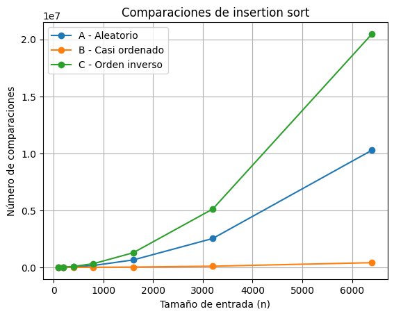
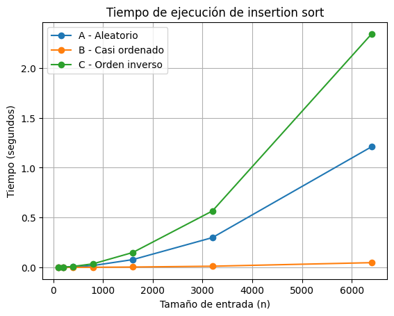
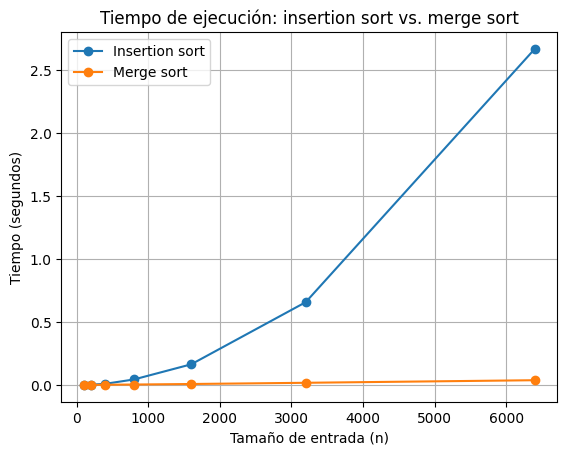

# Laboratorio evaluativo 01 — Fundamentos, complejidad y recurrencias

**Nombre:** Juan Felipe Cadavid Zabala

## Instrucciones para reproducir el experimento

Activar el entorno virtual desde la raíz del repositorio:

venv\Scripts\activate

Entrar a la carpeta del laboratorio:

cd laboratorios/lab1-fundamentos-complejidad-recurrencias

Ejecutar la Parte 3:

python parte3_casos.py

Ejecutar la Parte 4:

python parte4_complejidad.py

Las gráficas se generan automáticamente en la carpeta graficas/.

## Parte 1 — Analizar el algoritmo antes de comprar hardware

Antes de comprar un servidor más rápido considero necesario revisar primero el algoritmo que utiliza Tamiza. El hecho de que insertion sort lleve ocho años funcionando nos demuestra que puede producir un ordenamiento correcto, pero no significa que siga siendo una solución adecuada para la cantidad de información que maneja actualmente la plataforma.
Debemos separar dos aspectos. En primer lugar, la corrección: si el algoritmo termina, puede dejar los registros organizados por índice de riesgo como se necesita. En segundo lugar, está el tiempo que requiere para hacerlo. El proceso en Tamiza empieza a las 2:00 a. m. y debe terminar antes de las 6:00 a. m., por lo que dispone únicamente de cuatro horas. Esa condición ya se incumplió tres veces en las últimas semanas, aunque insertion sort siga produciendo correctamente el orden cuando alcanza a terminar.
También hay que tener en cuenta cuánto ha cambiado el tamaño del problema. Cuando la plataforma empezó, trabajaba con aproximadamente 20.000 registros, mientras que actualmente debe gestionar 1.200.000. Esto significa que la cantidad de registros es bastante mayor. En el peor caso el trabajo de insertion sort crece de forma cuadrática, por lo que una entrada que es aproximadamente 60 veces mayor puede representar un crecimiento mucho más grande que simplemente 60 veces el trabajo. El orden de crecimiento podría aumentar aproximadamente como (60^2), es decir, unas 3.600 veces. Esto no es algo exacto porque también influyen el hardware y la forma en que llegan los datos, pero sí muestra que el problema creció mucho más de lo que podría compensar únicamente duplicar la velocidad del servidor.
Un servidor del doble de velocidad podría reducir el tiempo de ejecución y posiblemente aliviar el problema por un tiempo, pero no cambia la forma en que crece insertion sort. Además, Tamiza recibe los datos en diferentes condiciones. Si llegan casi ordenados, insertion sort puede comportarse bien, pero si llegan en orden inverso, se acerca a su peor caso. Por eso no existe una garantía de que comprar una máquina dos veces más rápida sea suficiente para cumplir siempre la ventana de cuatro horas.
Un ejemplo similar sería un programa que busca un registro recorriendo uno por uno todos los elementos de una lista. Imaginemos un sistema departamental de tránsito con aproximadamente 500.000 registros de comparendos que debe responder una consulta en menos de un segundo. El programa puede encontrar siempre el dato correcto, por lo que funcionalmente cumple su objetivo. Sin embargo, si cada consulta necesita revisar cientos de miles de elementos y termina tardando varios segundos, deja de ser una solución viable para ese sistema, aunque entregue el resultado correcto.
Antes de aumentar la capacidad del servidor se debería analizar si existe un algoritmo cuyo crecimiento se adapte mejor a los 1.200.000 registros actuales y al posible aumento de datos en el futuro. El objetivo no es únicamente obtener el orden correcto, sino obtenerlo de manera confiable dentro de las cuatro horas disponibles.

## Parte 2 — Responsabilidad ambiental y ética de la implementación
Como responsable técnico de Tamiza considero que la elección del algoritmo no es solamente una decisión relacionada con la velocidad del programa. También tiene consecuencias ambientales y, sobre todo, consecuencias sobre las personas que dependen de la información producida por el sistema.
Desde el punto de vista ambiental, mientras más tiempo necesite el servidor para completar el proceso, más tiempo permanece trabajando bajo carga y más energía acumula consumida. La relación es sencilla: el consumo de energía depende de la potencia utilizada y del tiempo durante el cual se mantiene funcionando el equipo. En Tamiza esto es especialmente importante porque el ordenamiento no se ejecuta una sola vez, sino todas las madrugadas. Por eso, una diferencia de tiempo que parece pequeña en una noche se acumula al repetirse durante meses y años. Si existe un algoritmo capaz de realizar el mismo ordenamiento correctamente utilizando considerablemente menos tiempo, mantener uno más lento implica también mantener un consumo energético innecesario.

En la parte ética, el principal afectado por un fallo o una demora es el paciente. Por ejemplo, si el proceso alcanza a organizar una parte del lote pero deja registros pendientes y entre ellos se encuentra una persona con un índice de riesgo muy alto, ese paciente puede ser contactado más tarde de lo necesario. El costo principal del error lo asume esa persona, porque es su salud la que puede empeorar mientras espera una valoración. Su familia también puede sufrir las consecuencias de manera indirecta, pero el riesgo inmediato recae sobre el paciente.
También existe un impacto sobre el personal que utiliza el resultado. El operador del centro de contacto depende de la lista generada por Tamiza para saber a quién llamar primero. Si recibe una lista incompleta o incorrectamente ordenada, puede realizar su trabajo basándose en información equivocada. En este caso el operador asume parte del costo operativo, porque debe trabajar con una herramienta que no está entregando un resultado confiable, mientras que la Secretaría asume la responsabilidad de corregir el problema, atender posibles reclamos y recuperar la confianza en el servicio.
Sin embargo, tampoco considero correcto confiar ciegamente en el sistema. Deben existir controles que permitan detectar inconsistencias, registrar errores y enviar a revisión humana los casos que lo requieran. Esa revisión debería realizarla personal autorizado para valorar la información clínica, no simplemente cualquier operador del centro de contacto.
Además, en Tamiza el ordenamiento tiene una consecuencia especial: la posición de una persona en la lista determina qué tan pronto será contactada. Si un paciente con índice 950 aparece detrás de otro con índice 400, aunque ambos índices estén correctamente calculados, el algoritmo no estaría cumpliendo su función. Por eso la obligación no es únicamente terminar antes de las 6:00 a. m.; también debe respetar exactamente el orden de riesgo. Como responsable técnico, poner ese algoritmo en producción implica garantizar ambas cosas: que termine a tiempo y que la prioridad entregada corresponda realmente a los datos recibidos.
## Parte 3 — Peor caso, mejor caso y caso promedio

### 3.1 — Explicación y predicción

Para analizar el comportamiento de un algoritmo se deben comparar entradas que tengan el mismo tamaño `n`. A partir de ese tamaño fijo se pueden estudiar el mejor caso, el peor caso y el caso promedio.

El **mejor caso** corresponde a la entrada de tamaño `n` con la que el algoritmo realiza la menor cantidad de trabajo posible. Es decir, entre todas las entradas posibles de ese mismo tamaño se toma aquella que produce el menor costo.

El **peor caso** corresponde a la entrada de tamaño `n` que obliga al algoritmo a realizar la mayor cantidad de trabajo. En este caso se toma el máximo costo entre todas las entradas posibles que tengan ese mismo tamaño.

El **caso promedio** representa el comportamiento esperado del algoritmo entre las entradas posibles de tamaño `n`, teniendo en cuenta la forma en que se distribuyen esas entradas. No significa simplemente sacar un promedio entre el mejor y el peor caso, sino analizar cuánto trabajo se espera realizar normalmente bajo una determinada distribución de los datos.

Para decidir si el algoritmo de Tamiza puede entrar en producción, considero que el caso más importante es el **peor caso**. La plataforma tiene una restricción estricta de tiempo: el proceso comienza a las 2:00 a. m. y debe terminar antes de las 6:00 a. m., por lo que solamente dispone de cuatro horas. El caso promedio puede mostrar cómo podría comportarse el sistema normalmente, pero no garantiza que termine a tiempo cuando los datos lleguen en una condición desfavorable. Además, como los registros pueden provenir de diferentes canales, no se puede asumir que siempre llegarán casi ordenados. Por esta razón, conocer qué tan mal puede llegar a comportarse el algoritmo permite tomar una decisión más segura antes de ponerlo en producción.

#### Predicción de los escenarios

Antes de realizar las mediciones, considero que los tres escenarios de Tamiza van a mostrar comportamientos diferentes con *insertion sort*, debido principalmente al orden en el que llegan los registros.

Para el **escenario A — Aleatorio**, mi predicción es que se va a aproximar al **caso promedio**. Los registros llegan sin ningún orden relacionado con el índice de riesgo, por lo que algunos valores pueden quedar cerca de la posición que les corresponde y otros van a necesitar más comparaciones y desplazamientos. Por esta razón, espero un comportamiento intermedio entre los otros dos escenarios.

Para el **escenario B — Casi ordenado**, considero que va a ser el escenario **más cercano al mejor caso**. El 98 % de los registros ya corresponde a la lista del día anterior y se encuentra ordenado por índice de riesgo, mientras que solamente el 2 % de los registros nuevos se agrega al final sin ordenar. Como *insertion sort* funciona mejor cuando los datos ya están ordenados o muy cerca de estarlo, espero que este escenario sea el que necesite menos comparaciones y menos tiempo de ejecución de los tres. Sin embargo, no sería el mejor caso teórico exacto, porque todavía existe un 2 % de datos desordenados.

Finalmente, para el **escenario C — Orden inverso**, mi predicción es que representará el **peor caso**. Tamiza necesita ordenar los registros de mayor a menor índice de riesgo, pero el sistema legado los entrega de menor a mayor. Esto significa que los datos llegan exactamente en el sentido contrario al que se necesitan. Por esta razón, *insertion sort* tendría que realizar una gran cantidad de comparaciones y desplazamientos para llevar cada elemento hasta la posición correcta.

Por lo tanto, antes de realizar el experimento mi predicción es:

- **Escenario A — Aleatorio:** comportamiento cercano al caso promedio.
- **Escenario B — Casi ordenado:** comportamiento cercano al mejor caso.
- **Escenario C — Orden inverso:** peor caso.

Esta predicción se dejará registrada antes de realizar las mediciones y después se comparará con los resultados obtenidos en las gráficas de tiempo y número de comparaciones.

### 3.2 — Demostración experimental

Para comprobar la predicción anterior se ejecutó *insertion sort* sobre los tres escenarios de Tamiza utilizando tamaños de entrada de 100, 200, 400, 800, 1600, 3200 y 6400 registros. Para cada ejecución se registró el número de comparaciones entre elementos y el tiempo de ejecución medido con `time.perf_counter()`.

#### Comparaciones entre elementos

Los resultados muestran que el **escenario C — Orden inverso** fue el más costoso para *insertion sort*. A medida que aumenta el tamaño de la entrada, su número de comparaciones crece mucho más rápido que en los otros escenarios. Por ejemplo, con `n = 3200` realizó **5.118.400 comparaciones**.

El **escenario B — Casi ordenado** fue el más favorable. Para el mismo tamaño de `n = 3200` realizó solamente **98.648 comparaciones**, una diferencia considerable frente al escenario inverso. Esto ocurre porque la mayor parte de la lista ya se encuentra en el orden que Tamiza necesita y solamente una pequeña parte de los registros debe ser reubicada.

El **escenario A — Aleatorio** presentó un comportamiento intermedio. Para `n = 3200` realizó **2.533.103 comparaciones**, quedando entre los escenarios B y C. Por esta razón, dentro de este experimento es el escenario se aproxima al comportamiento de un caso promedio.

#### Tiempo de ejecución

La gráfica de tiempo presenta el mismo comportamiento general que la gráfica de comparaciones. El escenario B mantiene los menores tiempos, el escenario A queda en una posición intermedia y el escenario C presenta los mayores tiempos.

Con `n = 3200`, el escenario A tardó aproximadamente **0,298318 segundos**, el escenario B **0,011203 segundos** y el escenario C **0,565611 segundos**. Al aumentar el tamaño a `n = 6400`, el escenario A llegó a **1,209796 segundos** y el escenario B a **0,046880 segundos**, mostrando que la diferencia entre los escenarios se hace cada vez más visible al crecer la entrada.

#### Comparación con la predicción

Los resultados obtenidos coinciden con la predicción realizada en la sección 3.1. El escenario **B — Casi ordenado** resultó ser el más cercano al mejor caso, el escenario **A — Aleatorio** presentó un comportamiento intermedio que se aproxima al caso promedio y el escenario **C — Orden inverso** resultó ser el peor caso de los tres.

Esto permite observar experimentalmente que el desempeño de *insertion sort* depende fuertemente de la forma en que llegan los datos, incluso cuando todas las listas contienen exactamente la misma cantidad de elementos.

## Parte 4 — Complejidad de merge sort e insertion sort

### 4.1 — Cálculo teórico

#### Complejidad de merge sort

`Merge sort` utiliza la estrategia de **divide y vencerás**. Para ordenar una lista de tamaño `n`, primero la divide en dos partes y luego aplica el mismo procedimiento sobre cada mitad.

Su recurrencia es:

$$
T(n)=2T(n/2)+\Theta(n)
$$

El término `2T(n/2)` aparece porque se generan **dos subproblemas**, cada uno con aproximadamente la mitad de los elementos de la lista original.

El término `Θ(n)` corresponde al proceso de mezcla, ya que para unir las dos mitades ordenadas es necesario recorrer sus elementos hasta formar nuevamente la lista completa.

Para resolver la recurrencia utilizo el **método maestro**, cuya forma general es:

$$
T(n)=aT(n/b)+f(n)
$$

Para `merge sort` se tiene:

- `a = 2`, porque se generan dos subproblemas.
- `b = 2`, porque cada subproblema tiene la mitad del tamaño original.
- `f(n) = Θ(n)`, porque el proceso de mezcla requiere recorrer los elementos.

Ahora calculo:

$$
n^{\log_b a}
$$

Reemplazando los valores:

$$
n^{\log_2 2}=n^1=n
$$

$$
f(n)=\Theta(n)
$$

$$
n^{\log_b a}=n
$$

Como ambos tienen el mismo orden de crecimiento, corresponde al **caso 2 del método maestro**.

La solución es:

$$
T(n)=\Theta(n^{\log_b a}\log n)
$$

Reemplazando:

$$
T(n)=\Theta(n\log n)
$$

Por lo tanto, la complejidad temporal de `merge sort` es:

$$
\boxed{\Theta(n\log n)}
$$

Este comportamiento se mantiene en el **mejor caso**, **caso promedio** y **peor caso**, porque `merge sort` siempre realiza las divisiones y las mezclas de la misma forma, sin importar cómo estén organizados inicialmente los datos.

#### Complejidad de insertion sort

Para calcular la complejidad de *insertion sort* analizo las líneas de la implementación utilizada en el experimento.

| Instrucción | Número de ejecuciones en el peor caso |
|---|---:|
| `arreglo = datos.copy()` | `n` elementos copiados |
| `comparaciones = 0` | 1 |
| `for i in range(1, len(arreglo))` | aproximadamente `n` |
| `clave = arreglo[i]` | `n - 1` |
| `j = i - 1` | `n - 1` |
| condición `while j >= 0` | suma de aproximadamente `i + 1` |
| `comparaciones += 1` | \(\sum_{i=1}^{n-1} i\) |
| `arreglo[j] < clave` | \(\sum_{i=1}^{n-1} i\) |
| `arreglo[j + 1] = arreglo[j]` | \(\sum_{i=1}^{n-1} i\) |
| `j -= 1` | \(\sum_{i=1}^{n-1} i\) |
| `arreglo[j + 1] = clave` | `n - 1` |
| `return arreglo, comparaciones` | 1 |

En el peor caso, para cada posición `i`, el elemento actual debe compararse y desplazarse a través de todos los elementos anteriores. Por eso aparece la sumatoria:

\[
\sum_{i=1}^{n-1}i
\]

Aplicando la fórmula:

\[
\sum_{i=1}^{n-1}i=\frac{n(n-1)}{2}
\]

se obtiene:

\[
\frac{n^2-n}{2}
\]

Al sumar los demás términos lineales y constantes, el término que domina cuando `n` crece es `n²`. Por esta razón:

\[
T(n)=an^2+bn+c
\]

y su cota ajustada en el peor caso es:

\[
\boxed{\Theta(n^2)}
\]

En el mejor caso, cuando la lista ya se encuentra ordenada de mayor a menor, cada elemento necesita solamente una comparación con la parte anteriormente procesada y no requiere recorrer toda la lista. Por esta razón el mejor caso es:

\[
\boxed{\Theta(n)}
\]

Para una entrada aleatoria se espera que los elementos recorran, en promedio, una parte de los elementos anteriores. Aunque el número exacto de desplazamientos cambia, la sumatoria sigue teniendo crecimiento cuadrático, por lo que el caso promedio es:

\[
\boxed{\Theta(n^2)}
\]

#### Complejidades esperadas

| Algoritmo | Mejor caso | Caso promedio | Peor caso |
|---|---:|---:|---:|
| Insertion sort | Θ(n) | Θ(n²) | Θ(n²) |
| Merge sort | Θ(n log n) | Θ(n log n) | Θ(n log n) |

### 4.2 — Validación experimental

Para comprobar si lo que se calculó de forma teórica en la sección anterior realmente se puede observar en la práctica, ejecuté `insertion sort` y `merge sort` utilizando el **escenario A — Aleatorio**.

Para los dos algoritmos utilicé los mismos tamaños de entrada:

- 100
- 200
- 400
- 800
- 1600
- 3200
- 6400 registros

En cada tamaño generé una sola lista aleatoria y utilicé exactamente esa misma lista para probar los dos algoritmos. De esta forma, la comparación es más justa, porque ambos están trabajando con los mismos datos.

Para medir solamente el tiempo que tarda cada algoritmo en ordenar la lista utilicé `time.perf_counter()`.

En la gráfica se puede observar que, a medida que aumenta el tamaño de la entrada, el tiempo de `insertion sort` empieza a crecer mucho más rápido que el de `merge sort`.

Por ejemplo, para `n = 100`, `insertion sort` tardó aproximadamente **0,000544 segundos**, mientras que `merge sort` tardó **0,000348 segundos**. En este punto la diferencia todavía es pequeña porque la cantidad de datos también es pequeña.

Sin embargo, cuando aumenta el número de registros, la diferencia empieza a ser mucho más evidente.

Para `n = 3200` obtuve los siguientes tiempos:

- `Insertion sort`: **0,656472 segundos**
- `Merge sort`: **0,017279 segundos**

Finalmente, para `n = 6400`:

- `Insertion sort`: **2,664621 segundos**
- `Merge sort`: **0,037668 segundos**

En esta última prueba, `merge sort` fue aproximadamente **70,7 veces más rápido** que `insertion sort`.

La diferencia también se puede observar en la cantidad de comparaciones realizadas. Para `n = 6400`:

- `Insertion sort` realizó **10.276.753 comparaciones**.
- `Merge sort` realizó **72.967 comparaciones**.

Esto coincide con lo esperado según el análisis teórico de la sección 4.1.

En una entrada aleatoria, `insertion sort` tiene un comportamiento cercano a:

$$
\Theta(n^2)
$$

Por esta razón, cuando aumenta `n`, la cantidad de operaciones y el tiempo de ejecución aumentan rápidamente.

En cambio, `merge sort` tiene una complejidad de:

$$
\Theta(n \log n)
$$

Esto hace que pueda manejar tamaños de entrada más grandes sin que el tiempo aumente de una forma tan rápida.

En los tamaños pequeños no apareció un resultado diferente a lo esperado, ya que `merge sort` también fue más rápido. Sin embargo, al principio la diferencia entre los dos algoritmos era pequeña.

A medida que aumentó la cantidad de registros, la separación entre las dos curvas se hizo mucho más grande, mostrando de forma experimental la diferencia entre un crecimiento cercano a `Θ(n²)` y uno de `Θ(n log n)`.

### 4.3 — Concepto técnico a la Secretaría de Salud

#### Concepto técnico

Al equipo de ingeniería de la Secretaría de Salud:

Después de revisar tanto el análisis teórico como los resultados obtenidos en las pruebas, considero que para la plataforma Tamiza sería más conveniente reemplazar `insertion sort` por `merge sort` como algoritmo de ordenamiento.

La principal razón es que los registros no siempre van a llegar organizados de la misma forma y, según el caso planteado, se quiere mantener una sola implementación para todos los escenarios.

`Insertion sort` puede funcionar muy bien cuando los datos llegan casi ordenados, pero su rendimiento empeora bastante cuando los registros llegan de forma aleatoria o en orden inverso. En cambio, `merge sort` mantiene una complejidad de:

$$
\Theta(n \log n)
$$

sin importar cómo estén organizados inicialmente los datos.

Esto hace que `merge sort` tenga un comportamiento más estable y predecible frente a los diferentes escenarios que puede presentar Tamiza.

Los resultados obtenidos en las pruebas también muestran claramente esta diferencia. Para una entrada aleatoria de `n = 6400` se obtuvieron los siguientes resultados:

- `Insertion sort`: **2,664621 segundos** y **10.276.753 comparaciones**.
- `Merge sort`: **0,037668 segundos** y **72.967 comparaciones**.

En esta prueba, `merge sort` fue aproximadamente **70,7 veces más rápido** que `insertion sort`.

Tomando estos resultados como referencia, también se realizó una estimación para los **1.200.000 registros** que actualmente debe procesar la plataforma.

Para `insertion sort`, teniendo en cuenta su crecimiento aproximado de:

$$
\Theta(n^2)
$$

el tiempo estimado sería de aproximadamente **26 horas**.

En el caso de `merge sort`, utilizando su crecimiento:

$$
\Theta(n \log n)
$$

el tiempo estimado sería de aproximadamente **11,3 segundos**.

Es importante aclarar que estos tiempos son una **estimación** basada en las mediciones realizadas y en la complejidad de cada algoritmo. No corresponden a una prueba real con los 1.200.000 registros, por lo que pueden cambiar dependiendo del hardware, el sistema operativo y las condiciones reales del servidor.

También se analizó la posibilidad de mejorar el rendimiento utilizando un servidor más rápido. Si se supone de forma ideal que un servidor con el doble de velocidad pudiera reducir exactamente a la mitad el tiempo de `insertion sort`, este pasaría de unas **26 horas** a aproximadamente **13 horas**.

Aun así, seguiría siendo un tiempo mucho mayor que la ventana máxima de **4 horas**, por lo que aumentar el hardware no solucionaría realmente el problema principal.

Sin embargo, `merge sort` también tiene una desventaja que se debe tener en cuenta: el consumo de memoria.

Mientras que `insertion sort` trabaja principalmente sobre la misma lista, `merge sort` necesita utilizar estructuras auxiliares para realizar las divisiones y las mezclas. Por esta razón, antes de implementarlo en producción sería necesario verificar que el servidor tenga suficiente memoria para trabajar con todo el volumen de registros.

A pesar de esto, considero que la diferencia en tiempo de ejecución y la estabilidad que ofrece `merge sort` hacen que sea una mejor opción para este caso.

Por esta razón, mi recomendación sería implementar `merge sort` y antes de llevarlo definitivamente a producción realizar pruebas con cantidades de datos cercanas a los **1.200.000 registros**, revisando principalmente:

- El tiempo total de ejecución.
- El consumo de memoria.
- El comportamiento del algoritmo con diferentes órdenes de entrada.

De esta forma se podría comprobar en un entorno más cercano al real que `merge sort` cumple con las necesidades de la plataforma Tamiza.